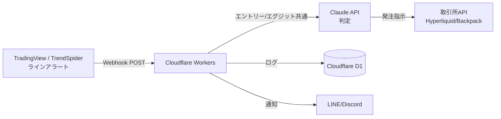

# line-trading-bot

TradingView / TrendSpider のライン系アラートをトリガーに、Claude API でエントリー/エグジットを判断し、
Hyperliquid / Backpack に自動発注する Cloudflare Workers ベースのトレード Bot。

## システム構成



1. TradingView / TrendSpider 上でラインに価格が接近/到達すると Webhook が POST される
2. Cloudflare Workers がペイロードを受け取り、ライン種別(エントリー/エグジット)と価格情報を抽出
3. ライン種別に応じたプロンプトを組み立てて Claude API に判定を依頼し、結果 (action/confidence/reason) を取得
4. 判定結果に応じて取引所 API を呼ぶ(エントリー: buy/sell、エグジット: close)
5. 判断内容や発注結果は Cloudflare D1 に永続化し、LINE/Discord に通知する

## Worker のコード構成

```
src/
  index.ts     Workers のエントリーポイント。/webhook を受け、即時200を返してから
               ctx.waitUntil() 内で後続処理(判定→発注→ログ→通知)を非同期実行する
  types.ts     Env(バインディング/シークレット)と共通の型定義
  webhook.ts   TradingView形式 / TrendSpider形式のペイロードを共通形式(NormalizedAlert)に正規化
  llm.ts       Claude API 呼び出し。ライン種別ごとにシステムプロンプトを分け、
               出力はJSON固定 ({"action","confidence","reason"}) でパースする
  exchange.ts  Hyperliquid / Backpack への発注。レート制限対策のリトライ+バックオフを実装
  db.ts        判定内容・発注結果を D1 (decisions テーブル) に記録
  notify.ts    発注結果を LINE Notify / Discord Webhook に通知
migrations/
  0001_init.sql  D1 の decisions テーブル定義
wrangler.toml    Workers の設定 (D1/KVバインディング、環境変数)
```

### 重複発火防止

`DEDUPE_KV` (Workers KV) に `銘柄:ライン種別:時刻バケット` をキーとして書き込み、
短時間 (デフォルト60秒。Workers KVの`expirationTtl`は60秒未満を指定できない制約がある) の
重複 Webhook をスキップする (`src/index.ts` の `isDuplicate`)。

### 検証モード (紙トレード)

`wrangler.toml` の `PAPER_TRADE` を `"true"` にしておくと、`src/exchange.ts` が実際の発注 API を呼ばず
`skipped` としてログだけ残す。LLM の判定精度を検証してから `"false"` に切り替えて実発注を有効化する。

## 事前に必要なもの

- Cloudflare アカウント (Workers / D1 / KV が使えるプラン)
- Node.js 18+ / npm
- Claude API キー
- Hyperliquid / Backpack の取引所 API キー・シークレット
- (任意) LINE Notify トークン、または Discord Webhook URL

## Worker インスタンスの作成手順

初回セットアップの流れ。すべて `wrangler` CLI (Cloudflare 公式) を使う。

### 1. 依存関係のインストールと Cloudflare ログイン

```bash
npm install
npx wrangler login
```

### 2. D1 データベースの作成

```bash
npx wrangler d1 create line-trading-bot
```

出力される `database_id` を `wrangler.toml` の `[[d1_databases]]` の `database_id` に貼り付ける。

続けてテーブルを作成する:

```bash
npm run db:migrate:remote
```

### 3. KV Namespace の作成(重複発火防止用)

```bash
npx wrangler kv namespace create DEDUPE_KV
```

出力される `id` を `wrangler.toml` の `[[kv_namespaces]]` の `id` に貼り付ける。

### 4. シークレットの設定

API キーはコードや `wrangler.toml` に書かず、すべて `wrangler secret put` で登録する。

```bash
npx wrangler secret put CLAUDE_API_KEY
npx wrangler secret put HYPERLIQUID_API_KEY
npx wrangler secret put HYPERLIQUID_API_SECRET
npx wrangler secret put BACKPACK_API_KEY
npx wrangler secret put BACKPACK_API_SECRET

# 通知先はどちらか一方でよい
npx wrangler secret put LINE_NOTIFY_TOKEN
npx wrangler secret put DISCORD_WEBHOOK_URL
```

### 5. ローカル動作確認 (任意)

```bash
npm run db:migrate:local
npm run dev
```

`http://localhost:8787/webhook` に対して、TradingView / TrendSpider 形式の JSON を POST して疎通確認する。
ローカル実行時はシークレット未設定だと Claude API / 取引所 API 呼び出しでエラーになるため、
プロジェクト直下に `.dev.vars` を作ってダミー値(またはテスト用の実キー)を入れておく。

```
CLAUDE_API_KEY=sk-ant-xxxx
HYPERLIQUID_API_KEY=dummy
HYPERLIQUID_API_SECRET=dummy
BACKPACK_API_KEY=dummy
BACKPACK_API_SECRET=dummy
```

**TradingView形式(エントリー)**

```bash
curl -X POST http://localhost:8787/webhook \
  -H "content-type: application/json" \
  -d '{
    "ticker": "BTCUSDT",
    "interval": "15",
    "close": 65000.5,
    "time": "2026-09-21T09:00:00Z",
    "exchange": "hyperliquid",
    "line_kind": "entry"
  }'
```

**TradingView形式(エグジット)**

```bash
curl -X POST http://localhost:8787/webhook \
  -H "content-type: application/json" \
  -d '{
    "ticker": "BTCUSDT",
    "interval": "15",
    "close": 63800.0,
    "time": "2026-09-21T10:30:00Z",
    "exchange": "hyperliquid",
    "line_kind": "exit"
  }'
```

**TrendSpider形式(エントリー、Hyperliquid宛)**

```bash
curl -X POST http://localhost:8787/webhook \
  -H "content-type: application/json" \
  -d '{
    "alert_symbol": "ETHUSDT",
    "last_price": 3200.25,
    "price_action_event": "touch",
    "alert_note": "entry:hyperliquid"
  }'
```

**TrendSpider形式(エグジット、Backpack宛)**

```bash
curl -X POST http://localhost:8787/webhook \
  -H "content-type: application/json" \
  -d '{
    "alert_symbol": "ETHUSDT",
    "last_price": 3100.0,
    "price_action_event": "break_through",
    "alert_note": "exit:backpack"
  }'
```

いずれも即座に `ok` (200) が返り、判定・発注・ログ記録は `ctx.waitUntil()` 内で非同期に走る。
`npm run dev` のログか `wrangler d1 execute line-trading-bot --local --command "select * from decisions"`
で結果を確認できる。同じペイロードを60秒以内に連投すると重複防止 (`DEDUPE_KV`) でスキップされる。

### 6. デプロイ

```bash
npm run deploy
```

デプロイ後に表示される `https://line-trading-bot.<subdomain>.workers.dev/webhook` を
TradingView / TrendSpider のアラート Webhook URL に設定する。

### 7. TradingView / TrendSpider 側のアラート設定

- **TradingView**: ラインを右クリック→「アラートを追加」。条件は「交差」、トリガー頻度は
  「Once Per Bar Close」推奨(連発防止)。Webhook メッセージは `{{ticker}}`, `{{interval}}`,
  `{{close}}`, `{{time}}`, `{{exchange}}` に加えて `line_kind` ("entry"/"exit") を含む JSON にする。
- **TrendSpider**: ラインを右クリック→「Create Alert」。条件は touch/break_through/bounce から選択。
  `alert_note` に `entry:hyperliquid` のように `ライン種別:取引所` を埋め込んでおくと Worker 側で判別できる。
- エントリー系/エグジット系でアラート数のプラン上限に注意し、運用前に確認する。

## 運用フェーズ

1. `PAPER_TRADE=true` のまま紙トレードで判定ログのみ蓄積し、実際の値動きと突き合わせて精度を検証
2. 閾値・プロンプトをチューニング
3. 一定期間の精度が確保できたら、エントリー→エグジットの順に `PAPER_TRADE=false` にして実発注を有効化
   (エグジットは LLM 判定を挟む分レイテンシが増えるため特に慎重に検証する)

## 未確定事項・TODO

- [ ] ポジションサイズ/資金管理ルール(1ラインあたりの資金配分、同時保有ポジション数の上限)
- [ ] エントリー後の損切/利確ラインをどう自動登録するか
- [ ] TradingView/TrendSpider のアラート上限と、監視したいライン数の見積もり
- [ ] Hyperliquid/Backpack の発注APIレート制限とエラー時のリトライ仕様の詰め
- [ ] LLM呼び出しのコスト/レイテンシが実運用で許容範囲かの検証
